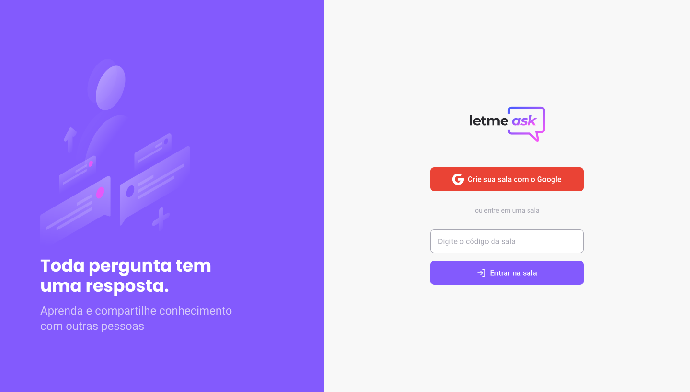

<p align="center">
  
</p>

<p align="center">
  
  
</p>

<h1 align="center">
    
</h1>

<h3 align="center">
    Create rooms to publish and answer questions.
</h3>

<p align="center">
  

  

  <a href="https://www.twitter.com/daniel_leal1/">
    
  </a>

  <a href="https://github.com/daniel-leal/letmeask/commits/master">
    
  </a>

   
   <a href="https://github.com/daniel-leal/letmeask/stargazers">
    
  </a>
</p>

<h4 align="center">
	 Status: In progress
</h4>

<p align="center">
 <a href="#about">About</a> •
 <a href="#features">Features</a> •
 <a href="#layout">Layout</a> •
 <a href="#how-it-works">How it works</a> •
 <a href="#tech-stack">Tech Stack</a> •
 <a href="#author">Author</a> •
 <a href="#user-content-license">License</a>

</p>

## About let me ask

💡 Let me ask - is an open source project made in Next Level Week Together by rocketseat. [DEMO](https://letmeask-c54d5.web.app/)

---

## Features

- [x] Create rooms
- [x] Enter rooms
- [x] Enter admin rooms
- [x] Add questions
- [x] Answer questions
- [x] Highlight questions

---

## Layout

The application layout is available on Figma:

<a href="https://www.figma.com/file/aJlXp6t9uFkuXzjggwAIW7/Letmeask?node-id=0%3A1">
  
</a>

---

## How it works

This project is divided into two parts:

1. Backend (Firebase)
2. Frontend (React)

### Pre-requisites

Before you begin, you will need to have the following tools installed on your machine:
[Git] (https://git-scm.com), [Node.js] (https://nodejs.org/en/).
In addition, it is good to have an editor to work with the code like [VSCode] (https://code.visualstudio.com/)

#### Rodando o Projeto

```bash

# Clone this repository
$ git clone git@github.com:daniel-leal/letmeask.git

# Access the project folder cmd/terminal
$ cd letmeask

# install the dependencies
$ yarn

# Run the application in development mode
$ yarn start

# The server will start at port: 3000 - go to http://localhost:3000

```

---

## Tech Stack

The following tools were used in the construction of the project:

#### **Website** ([React](https://reactjs.org/) + [TypeScript](https://www.typescriptlang.org/))

- **[React Router Dom](https://github.com/ReactTraining/react-router/tree/master/packages/react-router-dom)**
- **[SASS](https://www.npmjs.com/package/sass)**
- **[Firebase](https://firebase.google.com/docs/web/setup?hl=pt-br)**
- **[ESLint](https://eslint.org/)**
- **[Prettier](https://prettier.io/)**
- **[Styled-Components](https://styled-components.com/)**

> See the file [package.json](https://github.com/daniel-leal/letmeask/blob/master/web/package.json)

#### [](https://github.com/danieletmeask/Ecoleta#utilit%C3%A1rios)**Utilitários**

- Prototype: **[Figma](https://www.figma.com/)**
- Editor: **[Visual Studio Code](https://code.visualstudio.com/)**
- Markdown: **[StackEdit](https://stackedit.io/)**, **[Markdown Emoji](https://gist.github.com/rxaviers/7360908)**
- Fonts: **[Poppins](https://fonts.google.com/specimen/Poppins)**, **[Roboto](https://fonts.google.com/specimen/Roboto)**

---

## How to contribute

1. Fork the project.
2. Create a new branch with your changes: `git checkout -b my-feature`
3. Save your changes and create a commit message telling you what you did: `git commit -m" feature: My new feature "`
4. Submit your changes: `git push origin my-feature`

---

## Author

 
 <br />
 <sub><b>Daniel Leal</b></sub>
 <br />

[](https://twitter.com/daniel-leal) [](https://www.linkedin.com/in/daniel-leal/)
[](mailto:daniel-leal@gmail.com)

---

## License

This project is under the license [MIT](./LICENSE.md).

Made with ❤ by Daniel Leal 👋🏽 [Get in Touch!](https://www.linkedin.com/in/daniel-borges-leal-58198087/)
